**Cross-Site Scripting (XSS)** là một loại lỗ hổng bảo mật trong ứng dụng web, nơi kẻ tấn công chèn mã độc hại (thường là JavaScript) vào trang web. Khi người dùng truy cập trang web, mã độc được thực thi trong trình duyệt của họ, dẫn đến các hậu quả nguy hiểm.

**Phân loại XSS:**
    -   Stored XSS (Persistent XSS)
    -   Reflected XSS (Non-Persistent XSS)
    -   DOM-Based XSS

**Stored XSS (Persistent XSS):** Mã độc được lưu trữ trên máy chủ web (e.g., trong cơ sở dữ liệu, nhật ký).
Ví dụ: Kẻ tấn công chèn mã JavaScript độc hại vào phần bình luận của trang web. Khi người dùng truy cập, mã sẽ được thực thi.

**Reflected XSS (Non-Persistent XSS):** Mã độc không được lưu trữ mà được phản hồi lại ngay lập tức qua các tham số URL, biểu mẫu, hoặc yêu cầu HTTP.
Ví dụ: Một liên kết độc hại chứa mã JavaScript được gửi qua email. Khi người dùng nhấp vào, mã sẽ được thực thi.

**DOM-Based XSS:** Lỗi xảy ra trên trình duyệt khi ứng dụng thao tác DOM (Document Object Model) mà không kiểm tra hoặc mã hóa dữ liệu đầu vào.
Ví dụ: JavaScript trên trang web lấy dữ liệu từ URL và chèn trực tiếp vào DOM mà không kiểm tra.

**Nguy cơ của XSS**
    -   Đánh cắp thông tin: Kẻ tấn công có thể lấy cắp cookies, token xác thực, hoặc dữ liệu nhạy cảm.
    -   Chèn nội dung độc hại: Hiển thị nội dung lừa đảo hoặc giả mạo giao diện trang web.
    -   Chiếm quyền điều khiển tài khoản: Khi cookie phiên bị đánh cắp, kẻ tấn công có thể giả danh người dùng.
    -   Tấn công mạng nội bộ: Sử dụng mã độc để thực hiện các yêu cầu đến hệ thống nội bộ của nạn nhân.

**Ví dụ XSS:**
    -   **Stored XSS:**
            Người dùng nhập vào biểu mẫu bình luận: 
            Mã này được lưu trữ trong cơ sở dữ liệu và thực thi trên trình duyệt của những người khác.

    -   **Reflected XSS:**
            Kẻ tấn công gửi liên kết: http://example.com/search?q=
            Khi người dùng nhấp vào, mã , mã sẽ được thực thi.

**Cách phòng chống XSS:**
    -   Mã hóa (Encoding): Mã hóa đầu ra HTML, JavaScript, hoặc URL để ngăn mã độc thực thi.
        Ví dụ: Ký tự < thành &lt;, ký tự > thành &gt;.

    -   Kiểm tra và lọc đầu vào: Loại bỏ các ký tự đặc biệt hoặc cú pháp không mong muốn từ đầu vào của người dùng.

    -   Sử dụng thư viện an toàn: Sử dụng các framework hoặc thư viện tự động mã hóa, như: Thymeleaf (Java). Angular (JavaScript).

    -   CSP (Content Security Policy): Cấu hình CSP để giới hạn mã nào được phép thực thi: Content-Security-Policy: script-src 'self';

    -   Sử dụng HTTPOnly Cookies: Bảo vệ cookies khỏi bị truy cập bởi mã JavaScript: Set-Cookie: sessionId=abc123; HttpOnly; Secure

                                                    **Test Open Cart Website**

1.  Truy cập trang tìm kiếm sản phẩm và nhập: 
=> Xem kết quả hiển thị. Nếu mã JavaScript được thực thi trong trang kết quả tìm kiếm, thì có lỗ hổng XSS.

2. Thêm đánh giá sản phẩm với nội dung: 
=> Mã JavaScript có xuất hiện và thực thi trong phần đánh giá không? Kiểm tra trên trang chi tiết sản phẩm.

                                                    **Sử dụng ứng dụng OWASP ZAP**

**OWASP ZAP (Zed Attack Proxy):** là một công cụ mã nguồn mở dùng để kiểm tra và phát hiện lỗ hổng bảo mật trong các ứng dụng web. Công cụ này được phát triển bởi dự án OWASP (Open Web Application Security Project).

**Lợi ích của OWASP ZAP:**
    -   Miễn phí và mã nguồn mở: Không cần trả phí, phù hợp cho cả cá nhân và doanh nghiệp.
    -   Dễ sử dụng: Giao diện thân thiện, dễ dàng làm quen cho người mới.
    -   Hỗ trợ đa nền tảng: Chạy trên Windows, macOS, và Linux
    -   Cộng đồng lớn: Được hỗ trợ bởi một cộng đồng người dùng và nhà phát triển lớn.

**Cách sử dụng OWASP ZAP:**
    1.  Truy cập và dowload: https://www.zaproxy.org/download/
    2.  Giải nén tệp tin vừa tải xuống
    3.  Truy cập app và set port và proxy phù hợp với webdriver
        
    4.  Thực hiện quét auto các lỗi của trang web: Click vào Automated Scan
        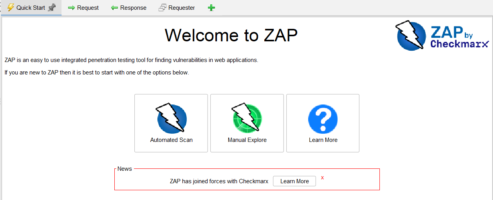
    5.  Điền url to attack là web cần kiểm tra: http://localhost/webopencart => Click attack
    6.  Khi click vào sẽ spider tất cả các link và text field của trang web để kiểm tra lỗi có thể xuất hiện
    7.  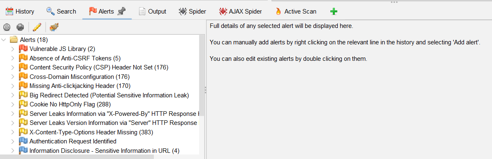
        a.  Alerts sẽ hiện các lỗi có thể xuất hiện trong trang web của bạn
        b. Các đọc và hiểu lỗi: 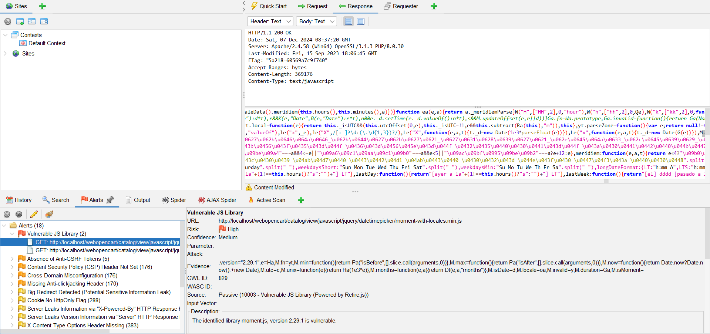 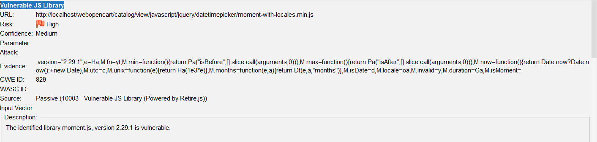
            1.  Phần in đậm là tên lỗi của bug: Vulnerable JS Library
            2.  Risk: là mức độ của lỗi VD: high, medium, low
            3.  Confidence: Độ chắc chắn của việc testing => Mức độ càng cao thì việc lỗi chắc chắn sẽ xảy ra trong trang web càng cao
            4.  Evidence: Bằng chứng cho việc bug xảy ra
            5.  Description: Mô tả bug
            6.  Request: đây là phần gửi các input tới trang web và phần nảy sẽ thể hiện thông tin các input gửi vào 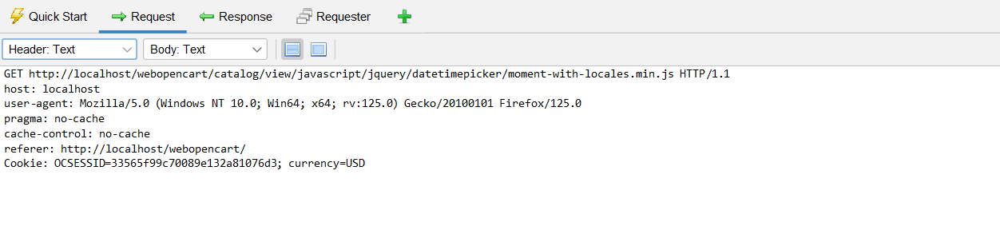
            7.  Response: Đây là phần trả lại của trang web và mình có thể kiểm tra các response có thể tạo lỗi ở đây 
            8.  Đây là phần chi tiết các lỗi và có cả phần Solution: 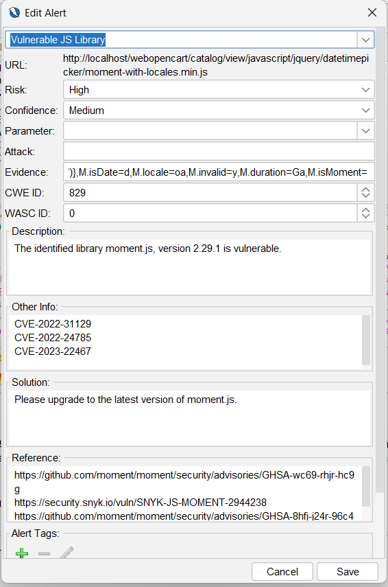
            9.  Đây là phần mình có thể kiểm tra các input mà trang ZAP đã thực hiện và có thể chạy lại hoặc có thể thay đổi giá trị của paramater
                để kiểm tra output: 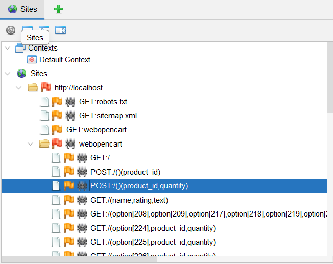

**Kết luận:** ZAP có thể giúp chúng ta tìm các potienal bug và đưa ra các solution => Chúng ta có thể dựa vào khả năng xảy ra của bug và các thông tin của ZAP để tái tạo lại bug để xác nhận các bug đó có thể xảy ra. Sau đó, nếu xảy ra các bug này xảy ra sẽ report lên Jira, Trello,... để cho dev có thể nhận thông tin và xử lí

**SQL injection:** là một lỗ hổng bảo mật xảy ra khi một ứng dụng web không xử lý đúng cách dữ liệu đầu vào, dẫn đến việc kẻ tấn công có thể chèn mã SQL độc hại vào câu truy vấn cơ sở dữ liệu. Mục tiêu của SQL Injection là truy cập trái phép vào dữ liệu nhạy cảm, sửa đổi hoặc phá hủy dữ liệu, hoặc thực hiện các thao tác không mong muốn trên cơ sở dữ liệu.

**Cách hoạt động của SQL Injection:** Kẻ tấn công chèn mã SQL độc hại vào các trường đầu vào của ứng dụng, chẳng hạn như:
    -   Trường đăng nhập
    -   Thanh tìm kiếm
    -   URL
    -   Form nhập liệu.

    Ví dụ, với một ứng dụng có câu truy vấn SQL như sau: 
    -   SELECT * FROM users WHERE username = 'input_username' AND password = 'input_password';
    -   ' OR '1'='1
    -   SELECT * FROM users WHERE username = '' OR '1'='1' AND password = '';

**Hậu quả của SQL Injection:**
    -   Lấy cắp dữ liệu nhạy cảm: Thông tin tài khoản, dữ liệu khách hàng.
    -   Phá hủy dữ liệu: Xóa hoặc chỉnh sửa cơ sở dữ liệu.
    -   Kiểm soát máy chủ: Nếu có quyền truy cập cao, kẻ tấn công có thể chiếm quyền điều khiển máy chủ.
    -   Xâm phạm quyền riêng tư: Công bố thông tin cá nhân hoặc nhạy cảm.

                                                        **Test SQL injection của trang web Open Cart**

**- Test Text field đăng nhập, đăng kí, search,...:**
    -   ' OR '1'='1
    -   ' OR 1=1 --
    -   ' UNION SELECT NULL, NULL, NULL #
    -   ' UNION SELECT oc_address, NULL FROM information_schema.tables --
    -   ' UNION SELECT lastname, NULL FROM oc_customer WHERE table_name='Quan' -- 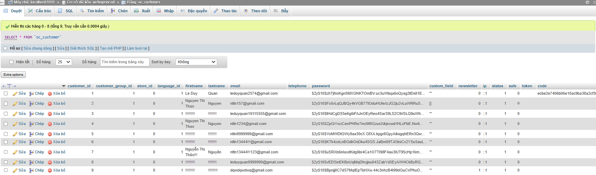

**-   Test URL của trang web:**
    -   index.php?route=product/product&product_id=' OR 1=1 --

                                                        Jira and Trello

**Jira:** là một công cụ mạnh mẽ để theo dõi lỗi và quản lý công việc, giúp tối ưu hóa quy trình làm việc và tăng cường sự phối hợp giữa các thành viên trong nhóm.

**Yêu cầu cần thiết:**
    -   Có tài khoản Jira và truy cập Jira
        VD: https://leduyquan2574.atlassian.net/jira/your-work
    -   Vào dự án bạn muốn quản lí lối hoặc tạo mới dự án: 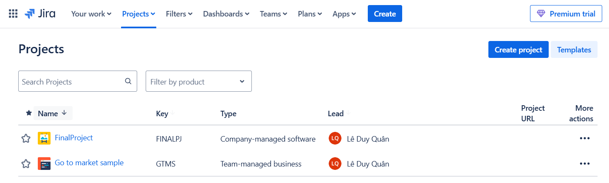
    -   Click **Create** bug: 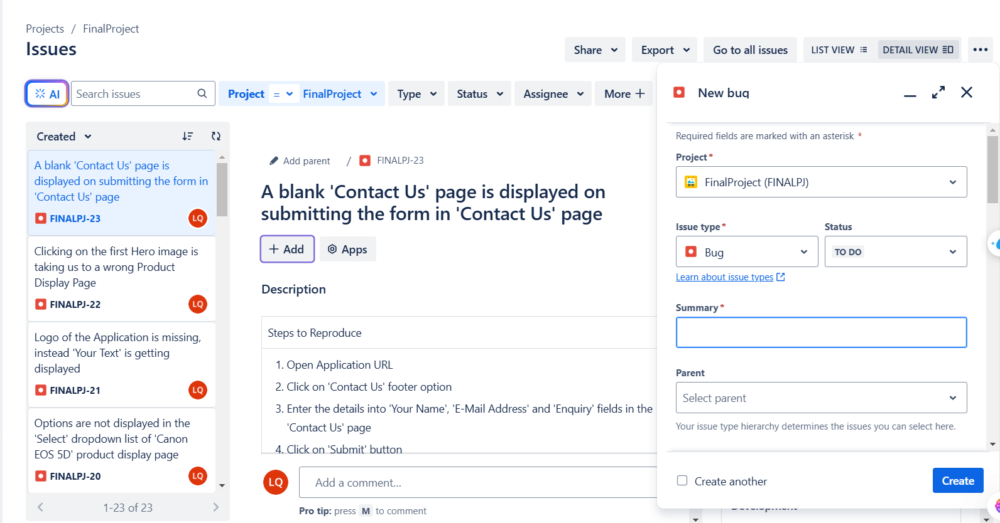
    -   Chọn loại issue là Bug.
    -   Điền các thông tin:
        -   Summary (Tóm tắt): Mô tả ngắn gọn về lỗi.
        -   Description (Mô tả): Mô tả chi tiết lỗi, cách tái hiện, và môi trường phát sinh.
        -   Priority (Mức độ ưu tiên): Xác định mức độ nghiêm trọng của lỗi (Low, Medium, High, Critical).
        -   Assignee (Người xử lý): Gán lỗi cho một thành viên trong nhóm.
    -   Nhấn "Create" để lưu lại.
    -   Solve các bug đã được tạo:
        -   Sử dụng các trạng thái trong workflow (ví dụ: Open, In Progress, Resolved, Closed) để cập nhật tiến độ xử lý. 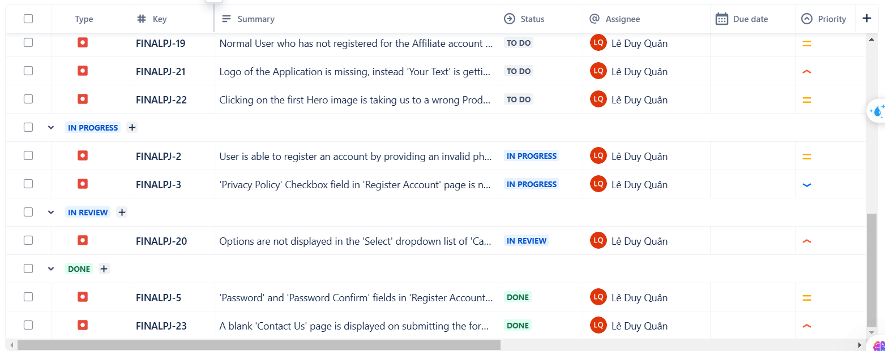
        -   Thêm bình luận vào lỗi để trao đổi thông tin. 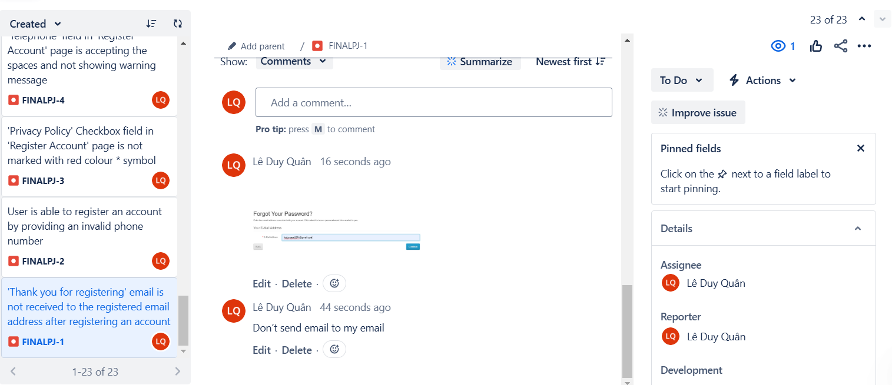
        -   Đính kèm file (ảnh chụp màn hình, log file) để hỗ trợ việc xử lý. 
        -   Sử dụng các báo cáo có sẵn (Burndown Chart, Issue Statistics,...) để theo dõi số lượng lỗi đã được xử lý và còn tồn đọng. 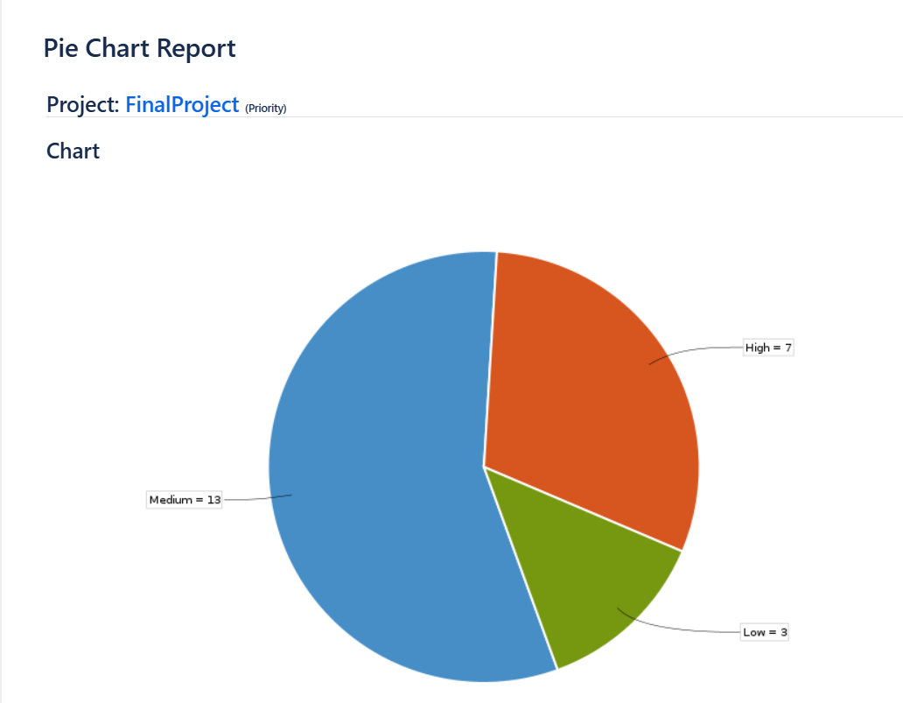

**Lợi ích khi sử dụng Jira để theo dõi lỗi:**
    -   Minh bạch: Toàn bộ lỗi và tiến độ xử lý được hiển thị rõ ràng.
    -   Hiệu quả: Giảm thời gian quản lý lỗi nhờ các tính năng tự động hóa.
    -   Phối hợp: Dễ dàng phân công công việc và trao đổi thông tin trong nhóm.

**Trello:** là một công cụ quản lý công việc và dự án trực quan, dựa trên phương pháp Kanban, được phát triển bởi Atlassian. Nó giúp các cá nhân và nhóm tổ chức, theo dõi, và quản lý công việc một cách đơn giản và hiệu quả thông qua các bảng (boards), danh sách (lists), và thẻ (cards).

**Cách sử dụng Trello:** 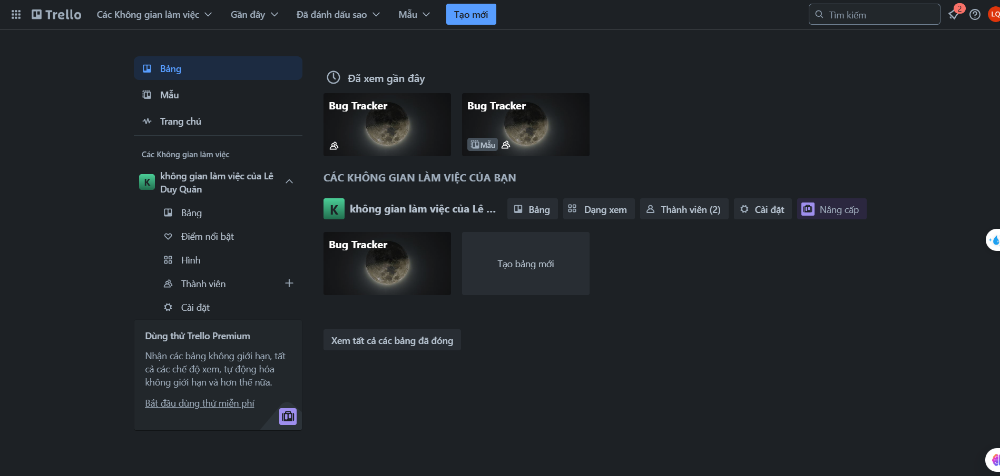 
    -   Chọn template để quản lí dự án: https://trello.com/u/leduyquan/boards
            VD: Bug Tracker
    -   Quản lí dự án đơn giản và đơn giản hóa việc theo dõi bug:   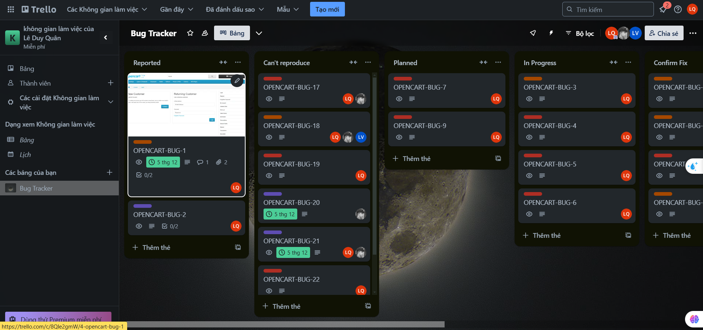
    -   Tạo và điền các thông tin cần thiết để sửa bug: 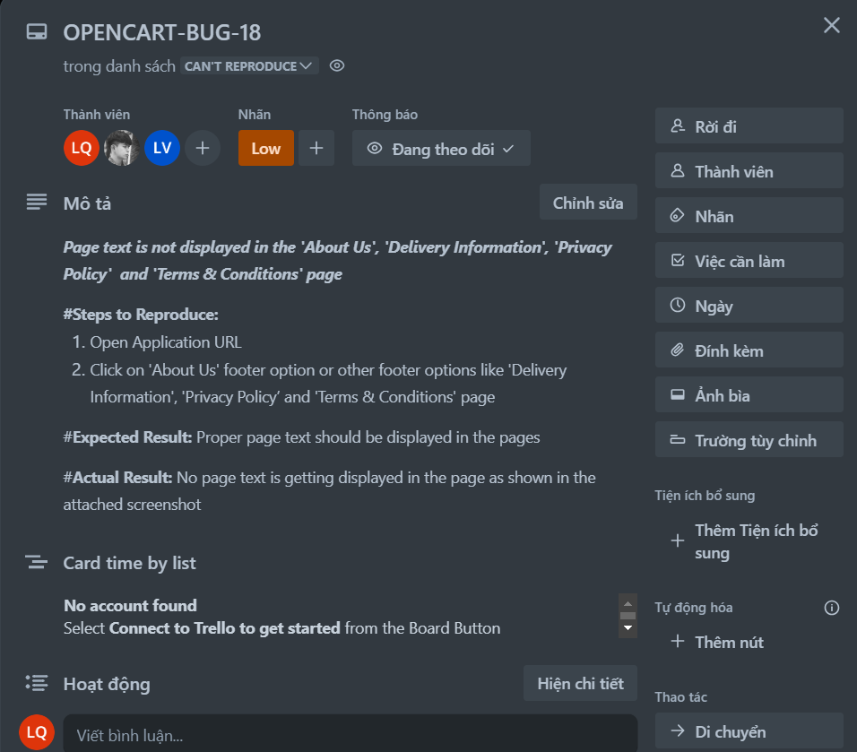

**Lợi ích của Trello**:
    -   Dễ sử dụng: Giao diện thân thiện, không yêu cầu kiến thức kỹ thuật.
    -   Minh bạch: Hiển thị trạng thái công việc một cách rõ ràng.
    -   Hiệu quả: Tăng năng suất nhờ khả năng quản lý công việc khoa học.
    -   Linh hoạt: Phù hợp với mọi quy mô dự án, từ cá nhân đến nhóm lớn.

**So sánh Jira và Trello**
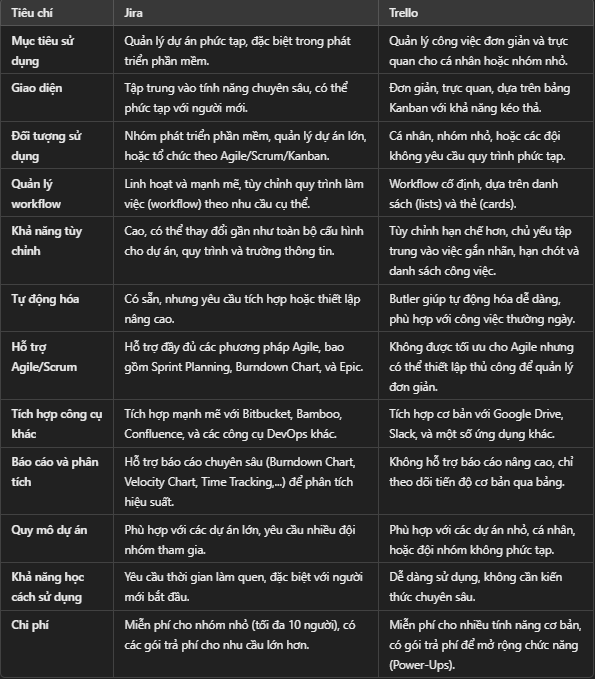

**Cách lựa chọn Jira hay Trello:**
    -   Chọn Jira nếu:
        -   Dự án của bạn phức tạp, cần theo dõi lỗi, phát triển phần mềm, hoặc quản lý theo Agile.
        -   Bạn cần báo cáo chuyên sâu và tùy chỉnh quy trình làm việc.
        -   Bạn có đội nhóm lớn và dự án dài hạn.
    -   Chọn Trello nếu:
        -   Bạn muốn một công cụ đơn giản, dễ sử dụng để quản lý công việc hoặc dự án cá nhân/nhóm nhỏ.
        -   Công việc không yêu cầu quy trình làm việc phức tạp.
        -   Bạn cần sự trực quan và khả năng sắp xếp nhanh chóng.# XSSProject
